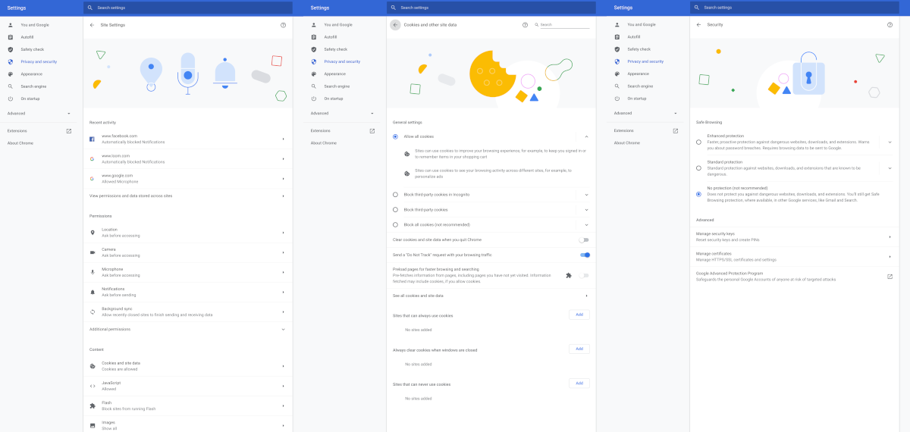

**Chrome OS Beta Channel got updated today - from 83.0.4103.15 to 83.0.4103.31**. This is a small update that rolled out to most Chromebooks. Some Chromebooks were on **83.0.4103.21** before making the jump to **83.0.4103.31**. I will write the notable changes from **83.0.4103.15** to **83.0.4103.31**.

_Note: SafetyNet is still broken in this release. That means Netflix and some apps can't be installed or used._

Notable new features from **83.0.4103.15** to **83.0.4103.31**:

## Chrome OS Settings

* **Power settings**

  + **Extra power settings** to change Chrome OS' idle behavior. Feature already available on **83.0.4103.21**.

* **Family Link**

  + **Allows Family Link managed users to add secondary EDU accounts.** To enable, enable `chrome://flags/enable-edu-coexistence` . Feature already available on 83.0.4103.21.

  + **Supervised users can now accept extension permission updates.** If an extensions developer pushes an update that requires additional permissions, and the extension was previously approved by the parent, and the parent has set the "Permissions for sites, apps and extensions" toggle to on, then the supervised user should be able to approve the additional permissions and re-enable the extension by themselves without parent approval.

  + **New parent consent logging in EDU account addition flow.** Parent consent gets logged to ARI before adding the account to the device. To enable, enable `chrome://flags/enable-edu-coexistence-consent-log` .

## Chrome Settings

* **Privacy and Security**

  + New Google illustrations in the brand new privacy redesign setting. **Requires** `chrome://flags/#privacy-settings/redesign` **to be enabled**. Feature already available on 83.0.4103.21.

These new illustrations can be found in Settings > Privacy and Security, where you can find "Cookies and Other Site Data", "Security", and "Site Settings".

**Notable fixes from 83.0.4103.15 to 83.0.4103.31:**

## Chrome OS Lock/Login Screen

+ Fixed a critical security issue with the new reveal password implementation in M83. If someone types and deletes a password and then gets up to leave, a passerby could try CTRL+Z to undelete and view the previously entered text. 
+ **Update: they decided to clear the password textfield after 30 seconds (including the edit history) instead of getting rid of Ctrl + Z alone.**

## Family Link

+ Various UI fixes

## Crostini

+ Fixed a crash when launching terminal.

## Ash

+ Fixed a crash when removing a notification during its animation out.

## Chrome Sync

+ Fixed a crash when a bookmark is restored after removing (using Undo action) and the corresponding entity is in an unsynced state.

Here are the official changelogs. Let me know if there are any errors or other official logs you guys want. Enjoy!

+ Official **83.0.4103.15** to **83.0.4103.31** changelog: [link](https://chromium.googlesource.com/chromium/src/+log/83.0.4103.15..83.0.4103.31?n=100000)

+ Official **83.0.4103.21** to **83.0.4103.31** changelog: [link](https://chromium.googlesource.com/chromium/src/+log/83.0.4103.21..83.0.4103.31?n=100000)

Official Update Announcement:
https://chromereleases.googleblog.com/2020/04/beta-channel-update-for-chrome-os_29.html
