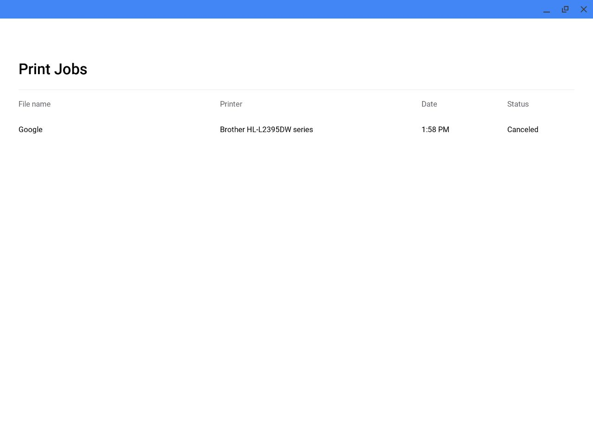
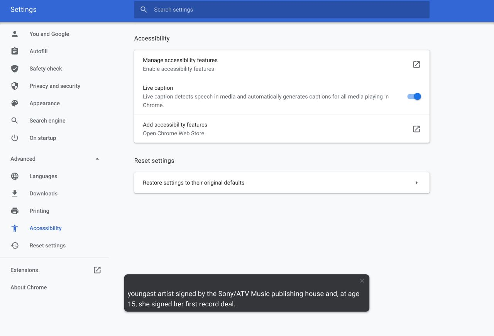

**Chrome OS Canary Channel got updated yesterday - from 84.0.4118.0 to 84.0.4127.0.** Here are the highlight changes I found that's new!

*Disclaimer: this is everything I found with this version of Chrome OS. There may be more things I might've missed. If you find a mistake or discover something new, feel free to let me know in the comments below.*

*This is also my first post where I talk about updates coming to Chrome OS.* **Feedback is extremely important to me.** *A simple "this bullet point doesn't make sense" will go a long way. I appreciate the feedback in advance.*

## Print/Scanning SWA:

+ Initial UI of the brand new Printing/Scanning SWA coming to Chrome OS.

+ Unlike previous versions of Chrome OS, 84.0.4127.0 shows a UI instead of placeholder text.

+ The SWA is very basic and only displays history of what was printed.

+ Chrome OS Scanning is **not working yet**.

+ To activate the SWA, enable `chrome://flags/#print-job-management-app`.

## Live Caption:

+ Brand new Live Caption feature coming to Chrome that functions just like Android's version of Live Caption.

+ Currently a placeholder and does not work.

+ To activate the Live caption toggle, enable `chrome://flags/#enable-accessibility-live-captions`.

## Ambient Lockscreen:

+ New animation from transitioning from ambient wallpaper to password.

## High Resolution Mouse Scrolling

+ **Initial High resolution mouse scrolling support** from supported mice that reports REL\_WHEEL\_HI\_RES from the Linux kernel.

+ To activate, enable `chrome://flags/#enable-high-resolution-mouse-scrolling`.

## Palm Rejection Improvements:

+ **New experiment** that suppresses touch when a stylus is on a touchscreen.
`video: https://www.youtube.com/watch?v=vZU11-hKPhw`

+ To activate, enable `chrome://flags/#enable-palm-suppression`.

## Chrome OS Settings updates:

+ **Power settings**

    + fix: removed “Sleep when lid is closed” toggle for devices without a lid.

+ **Language and input**

    + **New “Smart Inputs” section.** When enabled, Chrome OS will suggest personal information (address, location, etc) in the keyboard.

## Crostini:

+ **Mic settings** is enabled by default.

+ **Crostini disk resizing** is enabled by default.

+ **Crostini behavior changes:**

    + Crostini now takes more space - 2.0 GB instead of 1.8 GB. 1.8 GB "was cutting it too close."

    + Crostini will install on the smaller half of the free space available.

## WebUI:

+ **New Tab Page:** UI revamp when click the “Apps” icon

+ To preview the experimental WebUI New Tab page, enable `chrome://flags#ntp-webui`. This feature is available to test on all channels.

## Misc. Chrome flags:

+ Mysterious DLC experimental flag. This one's a complete mystery. It reads: “Enables DLC (Downloadable Content) Settings subpage in the Device section of OS Settings." The Controller is implemented in 84.0.4127.0, but not the code.

    + Controller: [link](https://chromium-review.googlesource.com/c/chromium/src/+/2163647)

    + Code: [link](https://chromium-review.googlesource.com/c/chromium/src/+/2165718)

+ Experimental cookie features flag. This is intended to facilitate testing in the future by allowing a single flag to be turned on instead of requiring multiple flags that all have dependencies on each other. To activate, enable `chrome://flags/#enable-experimental-cookie-features`.

For all other changes, [**see the official changelog**](https://chromium.googlesource.com/chromium/src/+log/84.0.4118.0..84.0.4127.0?n=100000).

At the time of writing: those of you on the Chrome OS Dev channel knows that there are a lot more stuff that's new in M84. I have them documented and will cover them in the future.