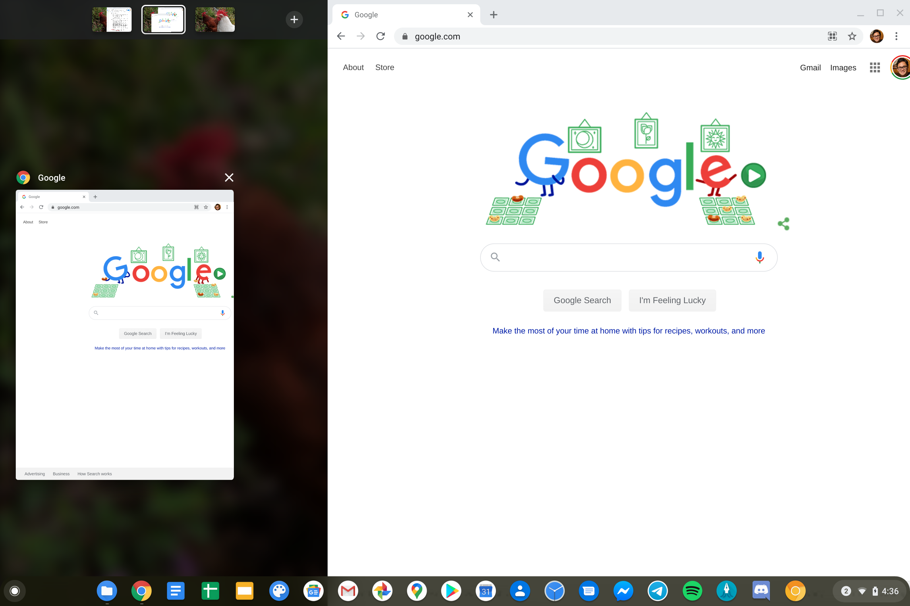
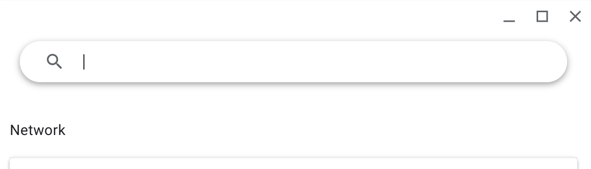
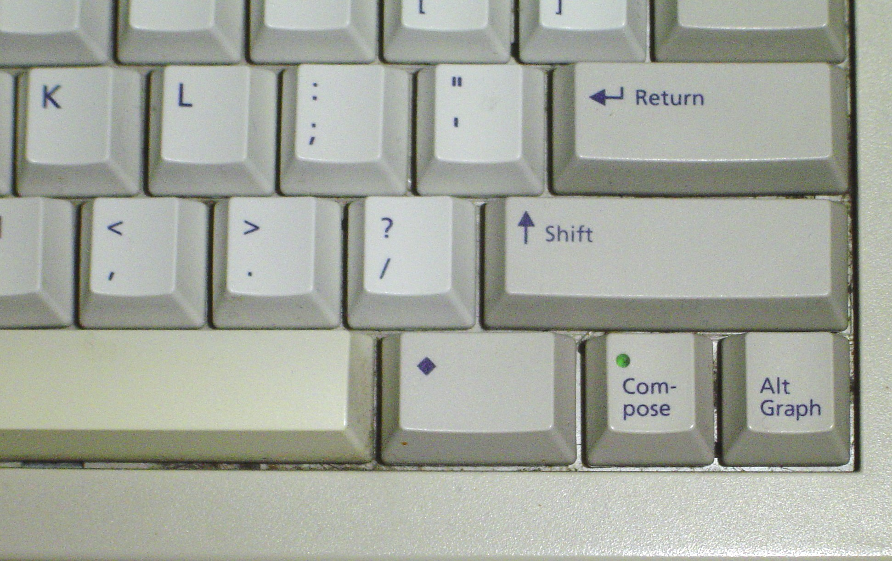
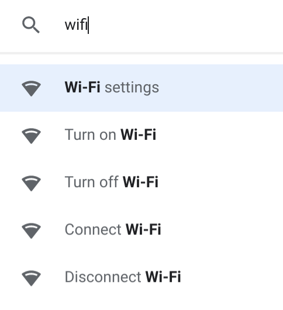
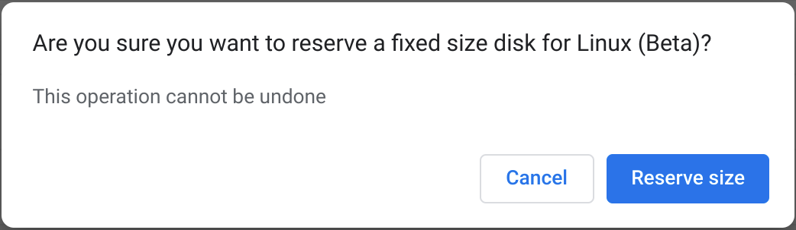

Hey folks, 

**Chrome OS Dev Channel got updated today** - from **84.0.4129.0** to **84.0.4133.0**. This is a nice update that is rolling out to most Chromebooks. Here is what changed!

_Disclaimer: this is everything I found with this version of Chrome OS. There may be more things I might've missed. If you find a mistake or discover something new, feel free to let me know in the comments below._

**I also decided to stop posting changes in the Canary channel.** The Canary channel updates way too quickly for me to keep up and some updates are too small. Big changes that come to Canary first like lacros-chrome will definitely be covered in its own post. Also, most of us are not on the Canary channel anyways since the channel is hidden behind Developer Mode. **I may change my mind with enough feedback though!**

## Notable new features from 84.0.4129.0 to 84.0.4133.0:

### Ash

* You can now unsnap a fullscreen Chrome/Android window by dragging down from the top bar. Not new to this build. [See screen recording uploaded here](https://imgur.com/a/l088PHL).

* Added movable partial screenshot. They will eventually add a “confirm” bubble, resizing handle on border, coordinates label with pseudo cursor, and magnifying glass in the future. I will demo a hands-on when these additions land. Enable `chrome://flags/#movable-partial-screenshot-region` to test.

* Virtual desk design/behavior when snapped window takes too much space. Not new to this build.

### Atlas:

* Pixelbook Go builds are now compiled with `-march=skylake` , which enables AVX vectorization. [u/xjrqh](https://www.reddit.com/u/xjrqh/) [made an awesome comment explaining what this is](https://www.reddit.com/r/chromeos/comments/gebj9w/chrome_os_dev_channel_got_updated_to_84041330/fpn74ud). Thanks!!

### Chrome OS Settings:

* The Search bar has a new design when clicking the magnifying glass while the window is narrow.

* The Caps Lock and Meta keys button can now be remapped. Can only be seen when using external keyboards. The Meta key is the “diamond” key found on really old keyboards. Requires `chrome://flags/#new-shortcut-mapping` to be enabled.

* Changed and added outlined icons to search. The outline icon may be a hint that an icon overhaul is coming to Chrome OS soon.

### Crostini:

* New confirmation dialog when resizing a sparse disk. Since this is an irreversible operation, a sparse disk should not be resized without warning the user.

### Files-ng:

* New paper-ripple animation effect when pointer interaction is happening (ie mouse down, touch) in files-ng’s menu.

* New flag that changes the Files app’s zip handling from **NaCL to FUSE**. NaCL is depreciated thanks to the momentum going into WebAssembly. At the time of typing, **this feature is very buggy** and will break copying zips (no space left error) and extracting. Test this feature by enabling `chrome://flags/#files-zip-no-nacl` .

### Lacros-chrome:

* New launcher icon for lacros-chrome on the Shelf that uses the Chrome Canary icon. Requires `chrome://flags/#lacros-support` to be enabled. Does **NOT** work yet!

[lacros launcher icon](./lacros-launcher-icon "lacros launcher icon")

### Media App SWA:

* UI tweaks with the three-dot menu.

* App name translated to other languages.

* (not new to this build) **New artwork** when dragging music and videos into the SWA. Can read metadata for both. [See these screenshots uploaded here](https://imgur.com/a/iUkLv6P). Thanks [u/joebobbio](https://reddit.com/u/joebobbio) and [u/Hupro](reddit.com/u/Hupro)!

### Shelf:

* New shelf app scaling flag that reduces the app icon size from standard to dense when the user exceeds the available space to add an additional app icon in tablet mode. I'm not able to get this to work yet, [so here is a visual example from the GNOME desktop environment of what it might do.](https://imgur.com/a/bWOATIB)

### Misc Flags:

* New flag that puts **interstitial warning on target embedding domains**. When enabled, navigating to a target embedding domain should result in showing a lookalike interstitial warning page.

* New flag to control the focus behavior of text fields in response to touch input. By default, they focus on tap down. When the flag is enabled, they wait until tap up to focus. Nothing special or noticeable to the user. Enable by enabling `chrome://flags/#textfield-focus-on-tap-up` .

* New flag that suggests words based on the current URL when clicking the omnibox. Try this feature by enabling `chrome://flags/#omnibox-on-focus-suggestions-contextual-web` .

* Edu coexistence and Edu Coexistence logging enabled by default. This is great news for Family-Link Chromebooks. [See my previous post to understand what they are](../beta-83-0-4103-31).

* **Sharing Send Via Sync** flag enabled by default.

## Fixed in this build:

* **Fixed cut and paste command in PDF viewer**. Recently, the clipboard was moved from being owned by the render process host to being owned by the render frame host. This didn’t apply to the PDF viewer, so it broke Copy/Paste. New commit fixes this.

* **Google Drive access fixed**.

* **Exo-pointer lock for Linux apps returns**. It disappeared due to the flag auto-expiring.

* Fixed app time limit notification not showing with child account while in fullscreen or when notification of the app is already in the tray.

* Fixed an “installed, but not loaded” error when extension is forcelisted in the policy.

* ~~Fixed High CPU usage with service worker on boot.~~

## Broken:

* Live Caption.

* SafetyNet.

* Crash when closing a Chrome custom tab window through an Android app. Not new to this build. See https://bugs.chromium.org/p/chromium/issues/detail?id=1078683 .

* Virtual keyboard doesn’t autocorrect/autocapitalize words.

* Lock screen sometimes randomly switches languages.

* High CPU with termina and service worker on boot. Kill it in task manager as a workaround.

* Some webpages fail to load all the way. Investigating this...

* Developer mode: `dev_install` does not work.

## Problems reported by commenters in my previous Dev post that I can’t replicate:

* Random disconnecting Bluetooth gaming controllers, including gamepads. I don’t have the equipment to test. ([u/arex333](https://reddit.com/u/arex333))

* Black pop-up windows with crostini apps when scrolling. Works okay for me. If you’re still having this issue, file feedback to Google via Alt + Shift + i. ([u/Muckinstein](https://reddit.com/u/Muckinstein))

* Can’t type into Linux app dialogs running in crosvm. Works okay for me. If you’re still having this issue, file feedback to Google via Alt + Shift + i. ([u/DaSpawn](https://reddit.com/u/DaSpawn))

Here is the [official changelog](https://chromium.googlesource.com/chromium/src/+log/84.0.4129.0..84.0.4133.0/?n=10000). Let me know in the comments below if there are any errors or other changes I might've missed. Enjoy!
